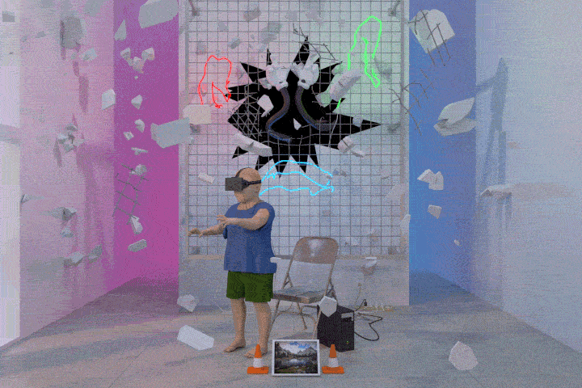

  
` AI ENGINEER @BPH200 | RESEARCH ASSISTANT @UAVR LABS(UCSC) | AR/VR/MR, VLM, CV, LLM, GraphML, RS `

 
  

  

  
 
#
 

> ###  ABOUT ME 

<!-- :man_student: &nbsp; ***Persuing MSc in Big Data Analytics, Robert Gordon University *** -->
:man_student: &nbsp; ***B.Tech: Graduate in the Department of Electrical & Electronics Engineering (EEE), National Institute of Technology Tiruchirappalli***

:briefcase: &nbsp; ***AI Engineer specialized in VLMs, LLM, SSL, Multitask-learning,CL,Deepmetric Learning, GenAI @ BPH200 ***
&nbsp;&nbsp;&nbsp;&nbsp;&nbsp;&nbsp;&nbsp; ***Former Research Assistant specialized in RS,SSL @ University of Colombo School of Computing:UAVR Lab ***
&nbsp;&nbsp;&nbsp;&nbsp;&nbsp;&nbsp;&nbsp; ***Former Undergraduate Research Fellow @ Indian Space Research Organisation:ISRO ***
&nbsp;&nbsp;&nbsp;&nbsp;&nbsp;&nbsp;&nbsp; ***Former Research Intern specialized in Remote Sensing, CV  @LIRNEasia  ***

:computer: &nbsp;***Have hands-on experience with Modeling, Training, and Deploying Deep Learning and Machine Learning algorithms related to Computer Vision, NLP on Cloud Platforms and Embedded Systems (TinyML)***
  - Vision Language Models (VLMs): Highly Experienced in working with state-of-the-art VLMs such as CLIP, BLIP, CLIPSeg, ViLT and X-CLIP along with creating pretext task training for an efficient way of adaptation.
  - Large Language Models (LLMs): Highly Experienced in working with state-of-the-art LLMs such as GPT-3, LLaMA, Falcon, and Mistral along with Fine-tuning.
  - Self-supervised Learning (SSL): Proficient in generating and tweaking pretext training strategies for various sectors of data, including vision problems, text problems, audio problems, vision and text problems, multi-spectral problems, and hyperspectral problems.
  - Generative AI: Proficient in generative AI techniques and their applications.
  - Deep Learning: Proficient in building and fine-tuning neural network models.
  - Machine Learning: Skilled in developing machine learning algorithms.
  <!-- - NLP (Natural Language Processing): Experienced in text analysis and language modeling. -->
  - Computer Vision: Knowledgeable in image processing and computer vision techniques.
  - Time Series:Skilled in developing deep learning algorithms for analyzing temporal content in hyperspectral/multispectral cube data. Also experienced in state-of-the-art models in time series transformer models like PatchTST, TimeGPT, Lag-Llama, TimesFM, and Chronos..
  <!-- - Mobile Applications: Specialized in integrating AI into mobile apps. -->
  - Embedded Systems (TinyML): Expertise in deploying machine learning on resource-constrained systems.

#
 

> ###  SKILLS & EXPERIENCES 

  
***Deep Learning*** | ***Computer Vision*** | ***NLP*** | ***Remote Sensing*** | ***Drone Operation*** | ***Multimodal AI***| ***TinyML***
  
 
<!--  -->

#
 

> ###  TOOLS 

 

#
 

<!-- > ###  GITHUB STATS 
 
<!-- 

 --> -->
